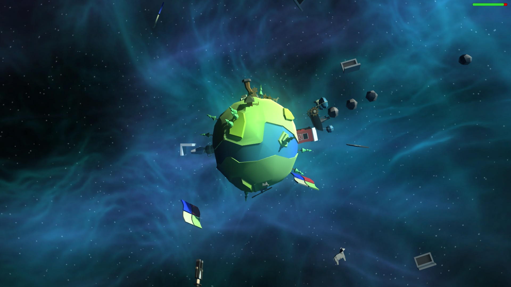

# Amish Paradise

Defend Amish planet from outter-space technology... with ancient technology!

## Gameplay

Protect the planet from outter-space dangers by rotating your spaceship around the planet and shooting menaces down. Amish planet will also defend itself by shooting rocks, cows... and even people.

## Controls

- Left and right arrows: rotate around the planet.
- Space: shoot!

## Developed for LDGC36 (Ludum Dare Gran Canaria 36)

- Patricio Romero - Art
- Ricardo López Toledo - Programming
- Moisés J. Bonilla Caraballo - Programming

## Third-party work

- Sounds and music have been downloaded from FreeSound.org and other free sources.
- Skybox taken from package "Skybox Volume 2 (Nebula)": https://www.assetstore.unity3d.com/en/#!/content/3392

## Downloads and online paying

* [Play online](http://moisesjbc.github.io/games/amish-paradise/index.html)
* [Amish Paradise entry at ludumdare.com](http://ludumdare.com/compo/ludum-dare-36/?action=preview&uid=57516)
